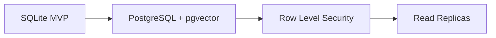

# MNEMOS – Teknik Yol Haritası

> **Versiyon:** 1.0  
> **Güncellenme:** 2026-01-08

---

## 🎯 Vizyon

MNEMOS, enterprise-grade güvenlik ve regülasyon uyumluluğu ile doğar. Bu yol haritası, MVP'den ölçeklenebilir SaaS'a geçiş stratejisini içerir.

---

## Faz 1: Foundation (Tamamlandı ✅)

| Özellik | Durum |
|---------|:-----:|
| SQLite + Prisma setup | ✅ |
| 21 DB model (User, Persona, Memory, Conversation...) | ✅ |
| NextAuth JWT authentication | ✅ |
| Field-level encryption (AES-256-GCM) | ✅ |
| Zero Trust data isolation | ✅ |
| Dual Process (System 1/2) engine | ✅ |
| Memory state management (ACTIVE/SUPPRESSED/RECALLED/ARCHIVED) | ✅ |
| Memory source tracking + confidence | ✅ |
| Hot/Cold storage tier tagging | ✅ |
| PersonalityDNA versioning | ✅ |
| Persona clone/fork fields | ✅ |
| AbuseLog (rate limiting/pattern detection) | ✅ |
| ApiKeyEvent audit trail | ✅ |
| ConsentRecord (GDPR scope tracking) | ✅ |
| UserEncryptionKey (crypto-shredding ready) | ✅ |

---

## Faz 2: Production Readiness (Q1 2026)

### 🔐 Güvenlik Hardening

- [ ] Rate limiter entegrasyonu (AbuseLog → auto-throttle)
- [ ] Behavior-based anomaly detection
- [ ] Prompt injection protection layer
- [ ] IP reputation scoring

### ⚖️ Hukuki Uyumluluk

- [ ] Consent flow UI (scope-based checkboxes)
- [ ] Right to Be Forgotten implementation (crypto-shredding activation)
- [ ] Data export API (JSON/PDF)
- [ ] AI Act disclosure notices

### 🧪 Test & Monitoring

- [ ] Integration tests for all API routes
- [ ] Consistency log dashboard
- [ ] Memory decay monitoring metrics
- [ ] PersonalityDNA drift alerts

---

## Faz 3: Scale (Q2 2026)

### 🐘 PostgreSQL Migration

**Migration Plan:**

1. **Prisma provider switch:** `sqlite` → `postgresql`
2. **Vector storage:** `embedding` column → `pgvector` extension
3. **JSON columns:** `String` → `JSONB` native type
4. **RLS policies:** Per-user/persona data isolation at DB level
5. **Connection pooling:** PgBouncer / Prisma Accelerate

### 🧊 Cold Storage Implementation

| Tier | Retention | Storage |
|------|-----------|---------|
| HOT | 30 days | Primary DB |
| WARM | 90 days | Compressed tables |
| COLD | ∞ | Object storage (S3/R2) |

- Automatic tier migration cron job
- On-demand recall from cold storage

### 💸 Premium Features

- [ ] Persona A/B testing (clone comparison)
- [ ] Personality drift analytics dashboard
- [ ] Multi-persona workspace
- [ ] Therapy session import integration

---

## Faz 4: Enterprise (Q3-Q4 2026)

### 🏢 Multi-Tenant Architecture

- Org → Users → Personas hierarchy
- Team-based persona sharing (read-only)
- Admin console for org management

### 🔌 Integrations

- [ ] Slack/Discord bot
- [ ] Calendar integration (context injection)
- [ ] Voice-only interface (phone)
- [ ] Mobile app (React Native)

### 🛡️ Compliance Certifications

- [ ] SOC 2 Type II audit prep
- [ ] GDPR Art. 30 records
- [ ] HIPAA compliance path (for therapy use cases)

---

## Metrikler & Başarı Kriterleri

| Metrik | Hedef (Q2) | Hedef (Q4) |
|--------|:----------:|:----------:|
| Persona sayısı | 100 | 10,000 |
| Günlük mesaj | 1,000 | 100,000 |
| Avg response time | <2s | <1s |
| Memory entries | 10,000 | 1M |
| Uptime | 99% | 99.9% |

---

## Yatırımcı Kopyası

> "MNEMOS, dünya genelinde nadir bulunan psikanalitik hafıza modeli ve graph-tabanlı değer sistemiyle, AI Therapy / Digital Twin pazarında lider olmaya aday. Enterprise-grade güvenlik altyapısı (Zero Trust, Field Encryption, Crypto-shredding) ile regülasyon-ready doğuyor."

---

> **Next Action:** Rate limiter entegrasyonu + Consent flow UI
