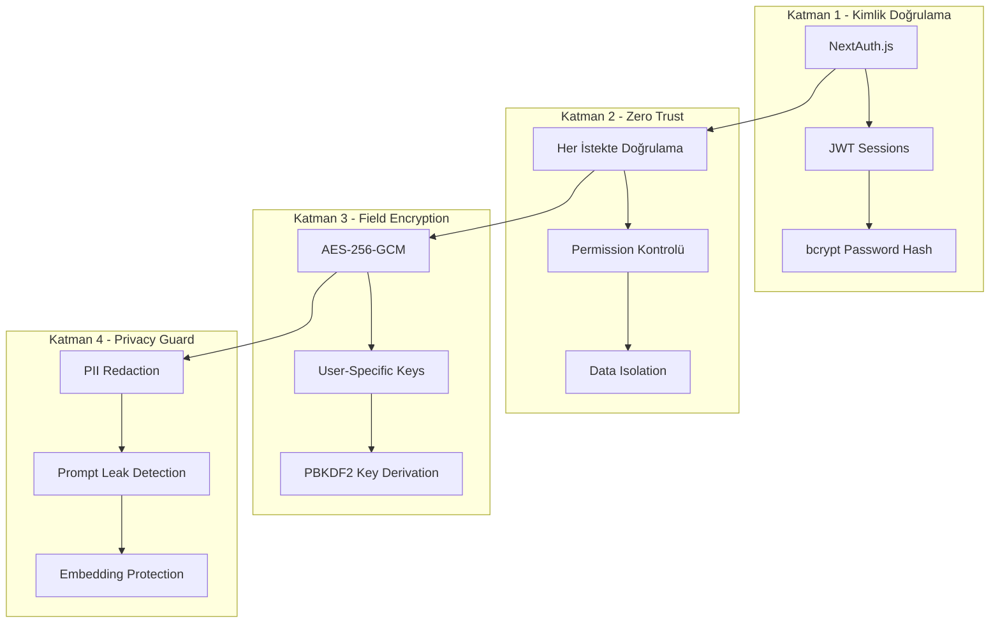
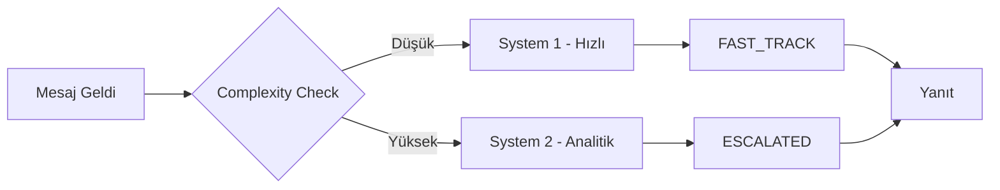

# MNEMOS – Veritabanı Yapısı ve Güvenlik Dokümantasyonu

> **Proje:** MNEMOS – Cognitive Preservation System  
> **Veritabanı:** SQLite (Prisma ORM)  
> **Dokümantasyon Tarihi:** 2026-01-08

---

## 📊 Genel Bakış

Bu proje, **psikanalitik hafıza modeli** ve **dijital kişilik motoru** üzerine kurulu bir yapay zeka platformudur. Veritabanı yapısı 4 ana kategori altında **17 model** içerir:

| Kategori | Model Sayısı | Açıklama |
|----------|:------------:|----------|
| Kullanıcı & Kimlik Doğrulama | 3 | User, ApiKey, Persona |
| Dijital Kişilik Motoru | 4 | PersonalityDNA, MentalStateLog, ValueNode, ValueEdge |
| Hafıza Sistemi | 4 | MemoryEntry, MemoryCluster, ProactiveMessage, IdentitySnapshot |
| Konuşma & Karar Takibi | 3 | Conversation, Message, Decision |
| Denetim & Loglama | 3 | UsageLog, AuditLog, ConsistencyLog |

---

## 🗃️ Veritabanı Tabloları

### 1. Kullanıcı & Kimlik Doğrulama

#### 1.1 `users` – Kullanıcı Tablosu

```
┌─────────────────┬──────────────┬─────────────────────────────────┐
│ Alan            │ Tip          │ Açıklama                        │
├─────────────────┼──────────────┼─────────────────────────────────┤
│ id              │ String (UUID)│ Birincil anahtar                │
│ email           │ String       │ Benzersiz e-posta adresi        │
│ password_hash   │ String       │ bcrypt ile hash'lenmiş şifre    │
│ name            │ String?      │ Kullanıcı adı (opsiyonel)       │
│ role            │ String       │ USER veya ADMIN                 │
│ is_active       │ Boolean      │ Hesap aktif mi?                 │
│ created_at      │ DateTime     │ Oluşturulma tarihi              │
│ updated_at      │ DateTime     │ Son güncelleme tarihi           │
└─────────────────┴──────────────┴─────────────────────────────────┘
```

**İlişkiler:**
- `1:N` → ApiKey (birden fazla API anahtarı)
- `1:N` → Persona (birden fazla persona)
- `1:N` → UsageLog, AuditLog

---

#### 1.2 `api_keys` – API Anahtarları

```
┌─────────────────┬──────────────┬─────────────────────────────────┐
│ Alan            │ Tip          │ Açıklama                        │
├─────────────────┼──────────────┼─────────────────────────────────┤
│ id              │ String (UUID)│ Birincil anahtar                │
│ user_id         │ String       │ Kullanıcı referansı (FK)        │
│ key_hash        │ String       │ Şifrelenmiş anahtar (benzersiz) │
│ key_prefix      │ String       │ Anahtar öneki (görüntüleme için)│
│ name            │ String       │ Anahtar ismi                    │
│ expires_at      │ DateTime?    │ Son kullanma tarihi             │
│ last_used_at    │ DateTime?    │ Son kullanım zamanı             │
│ is_active       │ Boolean      │ Aktif durumu                    │
└─────────────────┴──────────────┴─────────────────────────────────┘
```

> [!IMPORTANT]
> API anahtarları **asla** düz metin olarak saklanmaz. Yalnızca hash değeri depolanır.

---

#### 1.3 `personas` – Persona Profilleri

```
┌─────────────────────┬──────────────┬─────────────────────────────────┐
│ Alan                │ Tip          │ Açıklama                        │
├─────────────────────┼──────────────┼─────────────────────────────────┤
│ id                  │ String (UUID)│ Birincil anahtar                │
│ user_id             │ String       │ Kullanıcı referansı (FK)        │
│ name                │ String       │ Persona adı                     │
│ identity_memory     │ String?      │ Kimlik hafızası (JSON)          │
│ preferences         │ String?      │ Tercihler (JSON)                │
│ system1_weight      │ Float        │ Hızlı düşünce ağırlığı (0-1)    │
│ system2_weight      │ Float        │ Analitik düşünce ağırlığı (0-1) │
│ decision_threshold  │ Float        │ Karar eşiği (0-1)               │
└─────────────────────┴──────────────┴─────────────────────────────────┘
```

**Dual Process Theory Parametreleri:**
- `system1_weight`: Kahneman'ın Sistem 1'i – hızlı, sezgisel
- `system2_weight`: Kahneman'ın Sistem 2'si – yavaş, analitik
- `decision_threshold`: Ne zaman Sistem 2'ye eskalasyon yapılacağı

---

### 2. Dijital Kişilik Motoru

#### 2.1 `personality_dna` – Kişilik DNA'sı

> [!NOTE]
> Bu tablo değişmez çekirdek karakteristikleri saklar. Eğitimle değil, manuel kurulumla oluşturulur.

```
┌─────────────────────────┬──────────┬────────────────────────────────────────┐
│ Alan                    │ Tip      │ Açıklama                               │
├─────────────────────────┼──────────┼────────────────────────────────────────┤
│ id                      │ UUID     │ Birincil anahtar                       │
│ persona_id              │ String   │ 1:1 ilişki (benzersiz)                 │
│ dominance               │ Float    │ Baskınlık skoru (0-1)                  │
│ empathy                 │ Float    │ Empati kapasitesi (0-1)                │
│ logic_vs_emotion        │ Float    │ Mantık/duygu dengesi (0-1)             │
│ self_focus              │ Float    │ Ben-merkezcilik (0-1)                  │
│ conflict_style          │ String   │ direct, passive, avoidant, diplomatic  │
│ anger_threshold         │ Float    │ Sinir eşiği (0-1)                      │
│ praise_response         │ Float    │ Övgüye tepki (0-1)                     │
│ criticism_response      │ Float    │ Eleştiriye tepki (0-1)                 │
│ silence_comfort         │ Float    │ Sessizlik konforu (0-1)                │
│ max_sentence_length     │ Int      │ Maksimum cümle uzunluğu                │
│ max_questions_per_turn  │ Int      │ Soru başına maksimum soru sayısı       │
│ explain_everything      │ Boolean  │ Her şeyi açıkla modu                   │
└─────────────────────────┴──────────┴────────────────────────────────────────┘
```

---

#### 2.2 `mental_state_logs` – Ruh Hali Takibi

Her etkileşimde değişen dinamik state'i saklar:

```
┌─────────────────┬──────────┬────────────────────────────────────┐
│ Alan            │ Tip      │ Açıklama                           │
├─────────────────┼──────────┼────────────────────────────────────┤
│ energy          │ Float    │ Enerji seviyesi (0-1)              │
│ irritation      │ Float    │ Sinirlilik (0-1)                   │
│ confidence      │ Float    │ Özgüven (0-1)                      │
│ focus           │ Float    │ Odaklanma (0-1)                    │
│ openness        │ Float    │ Konuşmaya açıklık (0-1)            │
│ patience        │ Float    │ Sabır (0-1)                        │
│ time_of_day     │ String?  │ morning, afternoon, evening, night │
│ topic_heaviness │ Float    │ Konu ağırlığı (0-1)                │
│ turn_count      │ Int      │ Konuşma uzunluğu                   │
└─────────────────┴──────────┴────────────────────────────────────┘
```

**İndeksler:** `personaId`, `createdAt`

---

#### 2.3 `value_nodes` & `value_edges` – Değer Grafı

Kişinin değerlerini ve aralarındaki ilişkileri graf veri yapısında saklar:

**ValueNode (Düğümler):**
```
name: money, ethics, freedom, love, power, family, career, health
weight: 0-1 arası önem skoru
```

**ValueEdge (Kenarlar):**
```
relationship: supports | conflicts | neutral
strength: İlişki gücü (0-1)
```

> [!TIP]
> Bu yapı, etik çatışma durumlarında karar mekanizmasını etkiler. Örneğin: `money ↔ ethics` çatışması varsa, AI bu durumu fark eder.

---

### 3. Hafıza Sistemi (Psikanalitik Model)

#### 3.1 `memory_entries` – Hafıza Kayıtları

```
┌─────────────────┬──────────────┬─────────────────────────────────────────────┐
│ Alan            │ Tip          │ Açıklama                                    │
├─────────────────┼──────────────┼─────────────────────────────────────────────┤
│ id              │ UUID         │ Birincil anahtar                            │
│ persona_id      │ String       │ Persona referansı                           │
│ type            │ String       │ SHORT_TERM, EPISODIC, IDENTITY,             │
│                 │              │ INTERNAL_MONOLOGUE                          │
│ content         │ String       │ Hafıza içeriği                              │
│ embedding       │ String?      │ Vektör embedding (JSON array)               │
│ topic           │ String?      │ Konu etiketi                                │
│ people          │ String?      │ İlgili kişiler (JSON array)                 │
│ location        │ String?      │ Konum bilgisi                               │
│ emotion         │ String?      │ Birincil duygu                              │
│ importance_score│ Float        │ Önem skoru (0-1)                            │
│ access_count    │ Int          │ Erişim sayısı                               │
│ last_accessed   │ DateTime?    │ Son erişim zamanı                           │
│ expires_at      │ DateTime?    │ Son kullanma tarihi                         │
│ cluster_id      │ String?      │ Hafıza kümesi referansı                     │
└─────────────────┴──────────────┴─────────────────────────────────────────────┘
```

**Hafıza Tipleri:**

| Tip | Açıklama | Örnek |
|-----|----------|-------|
| `SHORT_TERM` | Kısa süreli, zamanla solan | Güncel konuşma detayları |
| `EPISODIC` | Olaysal, tetiklenebilir | "Geçen hafta yaptığımız görüşme" |
| `IDENTITY` | Değişmez kimlik bilgisi | "Ben bir yazılımcıyım" |
| `INTERNAL_MONOLOGUE` | İç ses, düşünce kaydı | "Bu konuda emin değilim..." |

---

#### 3.2 `memory_clusters` – Hafıza Kümeleri

```
┌─────────────┬──────────┬─────────────────────────────────────┐
│ Alan        │ Tip      │ Açıklama                            │
├─────────────┼──────────┼─────────────────────────────────────┤
│ name        │ String   │ Otomatik oluşturulan isim           │
│ description │ String?  │ Küme açıklaması                     │
│ centroid    │ String?  │ Küme merkez vektörü (JSON)          │
└─────────────┴──────────┴─────────────────────────────────────┘
```

Örnek kümeler: "Çocukluk Travması", "İş Stresi", "Aile İlişkileri"

---

#### 3.3 `identity_snapshots` – Kimlik Anlık Görüntüleri

Kimlik evriminin versiyonlarını saklar:

```
version: 1, 2, 3...
identity_state: Tam IdentityCore JSON
reason_for_change: "Kullanıcı tercih güncelledi"
```

---

### 4. Konuşma & Karar Takibi

#### 4.1 `conversations` – Konuşmalar

```
┌─────────────┬──────────┬───────────────────────────┐
│ Alan        │ Tip      │ Açıklama                  │
├─────────────┼──────────┼───────────────────────────┤
│ persona_id  │ String   │ Persona referansı         │
│ api_key_id  │ String   │ Kullanılan API anahtarı   │
│ started_at  │ DateTime │ Başlangıç zamanı          │
│ ended_at    │ DateTime?│ Bitiş zamanı              │
│ metadata    │ String?  │ Ek metadata (JSON)        │
└─────────────┴──────────┴───────────────────────────┘
```

---

#### 4.2 `messages` – Mesajlar

```
┌─────────────────┬──────────┬─────────────────────────────────┐
│ Alan            │ Tip      │ Açıklama                        │
├─────────────────┼──────────┼─────────────────────────────────┤
│ role            │ String   │ USER, ASSISTANT, SYSTEM         │
│ content         │ String   │ Mesaj içeriği                   │
│ reasoning_trace │ String?  │ Düşünce zinciri (JSON)          │
│ processing_type │ String   │ SYSTEM1, SYSTEM2, HYBRID        │
│ tokens_used     │ Int      │ Kullanılan token sayısı         │
│ latency_ms      │ Float    │ İşlem süresi (ms)               │
└─────────────────┴──────────┴─────────────────────────────────┘
```

---

#### 4.3 `decisions` – Karar Kayıtları

```
┌──────────────────┬──────────┬────────────────────────────────────┐
│ Alan             │ Tip      │ Açıklama                           │
├──────────────────┼──────────┼────────────────────────────────────┤
│ decision_context │ String   │ Karar bağlamı                      │
│ decision_outcome │ String   │ Karar sonucu                       │
│ confidence_score │ Float    │ Güven skoru (0-1)                  │
│ gate_result      │ String   │ FAST_TRACK veya ESCALATED          │
│ reasoning_chain  │ String?  │ Mantık zinciri (JSON)              │
└──────────────────┴──────────┴────────────────────────────────────┘
```

---

### 5. Denetim & Loglama

#### 5.1 `usage_logs` – Kullanım Logları

```
requests_count: İstek sayısı
tokens_input: Giriş token sayısı
tokens_output: Çıkış token sayısı
cost_usd: Maliyet (USD)
```

**Benzersiz kısıt:** `(userId, apiKeyId, logDate)`

---

#### 5.2 `audit_logs` – Denetim Logları

```
┌──────────────┬──────────┬─────────────────────────────────┐
│ Alan         │ Tip      │ Açıklama                        │
├──────────────┼──────────┼─────────────────────────────────┤
│ action       │ String   │ Yapılan işlem                   │
│ resource_type│ String   │ Kaynak tipi                     │
│ resource_id  │ String?  │ Kaynak ID'si                    │
│ old_value    │ String?  │ Eski değer (JSON)               │
│ new_value    │ String?  │ Yeni değer (JSON)               │
│ ip_address   │ String?  │ IP adresi                       │
│ user_agent   │ String?  │ Tarayıcı bilgisi                │
│ severity     │ String   │ INFO, WARNING, CRITICAL         │
└──────────────┴──────────┴─────────────────────────────────┘
```

---

#### 5.3 `consistency_logs` – Tutarlılık Logları

Persona'nın kendi ifadeleriyle tutarsızlıklarını tespit eder:

```
deviation_score: Sapma skoru (0-1)
detected_issue: Tespit edilen sorun
context: { pastStatement, currentStatement, topic }
```

---

## 🔐 Güvenlik Mimarisi

### Katmanlı Güvenlik Yaklaşımı



---

### 1. Kimlik Doğrulama (Authentication)

**Teknoloji:** NextAuth.js + Credentials Provider

```typescript
// Şifre doğrulama akışı
1. Kullanıcı email/şifre gönderir
2. prisma.user.findUnique({ email })
3. bcrypt.compare(password, user.passwordHash)
4. JWT token oluşturulur (7 gün geçerli)
```

**Session Stratejisi:**
- **Tip:** JWT (stateless)
- **Geçerlilik:** 7 gün
- **İçerik:** `{ id, email, name, role }`

---

### 2. Zero Trust Mimarisi

> [!CAUTION]
> Hiçbir bileşen "içerdeyim" varsayımı yapmaz. Her modül, her istekte yetki doğrular.

**Permission Tipleri:**

| Permission | Açıklama |
|------------|----------|
| `read:own_data` | Kendi verilerini okuma |
| `write:own_data` | Kendi verilerini yazma |
| `delete:own_data` | Kendi verilerini silme |
| `read:persona` | Persona bilgilerini okuma |
| `write:persona` | Persona bilgilerini yazma |
| `admin:all` | Tüm yetkiler |

**Data Isolation Algoritması:**

```typescript
// Her sorgu otomatik olarak izole edilir
function createIsolatedQuery(baseQuery, userId, personaId?) {
    query.where.personaId = personaId
    query.where.persona = { userId }
    // Başka kullanıcının verisine erişim İMKANSIZ
}
```

---

### 3. Alan Düzeyinde Şifreleme (Field-Level Encryption)

**Algoritma:** AES-256-GCM (Authenticated Encryption)

**Şifrelenen Alanlar:**
- `content` – Hafıza içeriği
- `identityMemory` – Kimlik verisi
- `emotionalContent` – Duygusal veri
- `conversation` – Sohbet mesajları
- `embedding` – Vektör embeddingler

**Anahtar Türetme Süreci:**

```
MASTER_KEY + userId
       ↓
  PBKDF2 (100k iterasyon, SHA-512)
       ↓
   USER_KEY (32 byte)
       ↓
  HMAC-SHA256(fieldName)
       ↓
   FIELD_KEY
```

> [!IMPORTANT]
> Anahtar rotasyonu desteklenmektedir. Her şifreli alanda `keyId` field'ı bulunur.

---

### 4. Privacy Guard

**Log Sanitizasyonu:**
- Hassas veriler SHA-256 ile hash'lenir
- Hash'ler 16 karaktere kısaltılır

**PII Koruma:**
- Otomatik PII tespiti ve redaksiyon
- Prompt injection koruması
- LLM yanıt izolasyonu

---

## ⚙️ Algoritmalar

### 1. Hafıza Solma Algoritması (Memory Decay)

```typescript
// Zaman ve erişim bazlı bozulma
function calculateDecayFactor(lastAccessTime, accessCount, emotionalWeight) {
    const daysSinceAccess = (now - lastAccessTime) / (1000 * 60 * 60 * 24)
    const accessBoost = 1 + (accessCount * 0.1)
    const emotionalBoost = 1 + (emotionalWeight * 0.5)
    
    // Üstel bozulma
    const decay = baseRate ^ (daysSinceAccess / (accessBoost * emotionalBoost))
    
    return clamp(decay, 0, 1)
}
```

**Önemli Özellikler:**
- Sık erişilen hafızalar daha yavaş solar
- Duygusal ağırlığı yüksek hafızalar daha kalıcı
- `SHORT_TERM` hafızalar 24 saat sonra solmaya başlar

---

### 2. Bastırma & Tetikleme (Suppression & Recall)

```typescript
// Bastırma - hafıza silinmez, gizlenir
async function suppressMemory(memoryId) {
    // state = 'SUPPRESSED'
    // suppressedAt = now
}

// Tetikleme - uygun tetikleyiciyle geri getirme
async function recallWithTrigger(trigger) {
    // Bastırılmış hafızalarda trigger aranır
    // Eşleşme bulunursa: state = 'RECALLED'
}
```

> [!NOTE]
> Psikanalitik modele uygun olarak hiçbir hafıza gerçekten silinmez, yalnızca bastırılır.

---

### 3. Tutarlılık Kontrolü (Consistency Check)

```
1. Yeni ifade alınır
2. Geçmiş ifadelerle karşılaştırılır (embedding similarity)
3. Çatışma tespit edilirse:
   - deviation_score hesaplanır
   - consistency_logs'a kayıt yapılır
   - AI yanıtı buna göre şekillendirilir
```

---

### 4. Dual Process Karar Mekanizması



**Gate Kararı:**
- `confidence_score < decision_threshold` → ESCALATED
- `confidence_score >= decision_threshold` → FAST_TRACK

---

## 📈 İndeks Stratejisi

| Tablo | İndeksler |
|-------|-----------|
| `memory_entries` | `(personaId, type)`, `topic`, `importanceScore` |
| `mental_state_logs` | `personaId`, `createdAt` |
| `value_nodes` | `personaId`, `(personaId, name)` benzersiz |
| `value_edges` | `personaId`, `(personaId, fromNodeId, toNodeId)` benzersiz |
| `conversations` | `personaId`, `apiKeyId` |
| `messages` | `conversationId` |
| `decisions` | `conversationId` |
| `audit_logs` | `userId`, `resourceType`, `severity` |
| `consistency_logs` | `personaId` |
| `proactive_messages` | `personaId`, `isDelivered` |

---

## 🔄 Cascade Silme Davranışları

```
User silindiğinde:
├── ApiKey → CASCADE (silinir)
├── Persona → CASCADE (silinir)
│   ├── MemoryEntry → CASCADE
│   ├── MemoryCluster → CASCADE
│   ├── PersonalityDNA → CASCADE
│   ├── MentalStateLog → CASCADE
│   ├── ValueNode → CASCADE
│   │   └── ValueEdge → CASCADE
│   ├── Conversation → CASCADE
│   │   ├── Message → CASCADE
│   │   │   └── Decision → CASCADE
│   │   └── Decision → CASCADE
│   ├── ConsistencyLog → CASCADE
│   ├── IdentitySnapshot → CASCADE
│   └── ProactiveMessage → CASCADE
├── UsageLog → CASCADE
└── AuditLog → SET NULL (log korunur)
```

---

## 📝 Önemli Notlar

1. **SQLite Kısıtlamaları:** JSON verileri string olarak saklanır ve uygulama katmanında parse edilir.

2. **Embedding Formatı:** Vektör embeddingleri JSON array string olarak depolanır (`"[0.1, 0.2, ...]"`).

3. **Zaman Damgaları:** Tüm tablolar `createdAt` ve uygun durumlarda `updatedAt` içerir.

4. **ID Stratejisi:** Tüm birincil anahtarlar UUID formatındadır.

5. **Soft Delete:** Sistem soft delete kullanmaz; bunun yerine psikanalitik "bastırma" modeli uygulanır.

---

> **Hazırlayan:** MNEMOS Cognitive Engine  
> **Versiyon:** 1.0  
> **Son Güncelleme:** 2026-01-08
