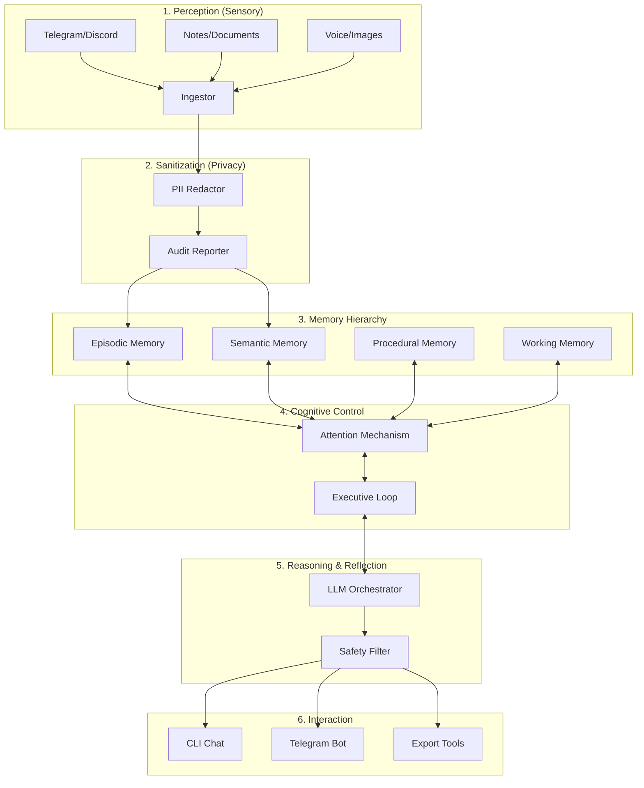

# ARCHITECTURE - MNEMOS

Mnemos is organized as a layered cognitive system, transforming raw sensory input into structured memory and reflective actions.

## 1. System Overview (The Layered Brain)

## 2. Component breakdown

### 2.1 core/ingestion
Translates raw file formats into a unified `TelegramMessage` (or DAO) base class.

### 2.2 core/privacy
The "Blood-Brain Barrier." Ensures no private entities (phones, emails, secrets) enter the memory system.

### 2.3 core/memory
The persistent storage engine.
- **Episodic**: Time-stamped event vector store.
- **Semantic**: Fact-based personal knowledge graph.
- **Controller**: Manages retrieval priority and consolidation.

### 2.4 core/cognition
The "Prefrontal Cortex." Implements the **Agent Loop**: Observe -> Retrieve -> Plan -> Act.

### 2.5 apps/
The interaction surfaces (CLI, Bots, Web).

## 3. Data Flow

1. **Perception**: Data flows from sources into JSONL artifacts.
2. **Redaction**: PII is stripped and logged in audit reports.
3. **Encoding**: Text is vectorized and stored in Episodic memory.
4. **Reasoning**: User query triggers memory retrieval -> LLM reflection -> response generation.
5. **Consolidation**: The system reflects on the interaction to update long-term knowledge.
